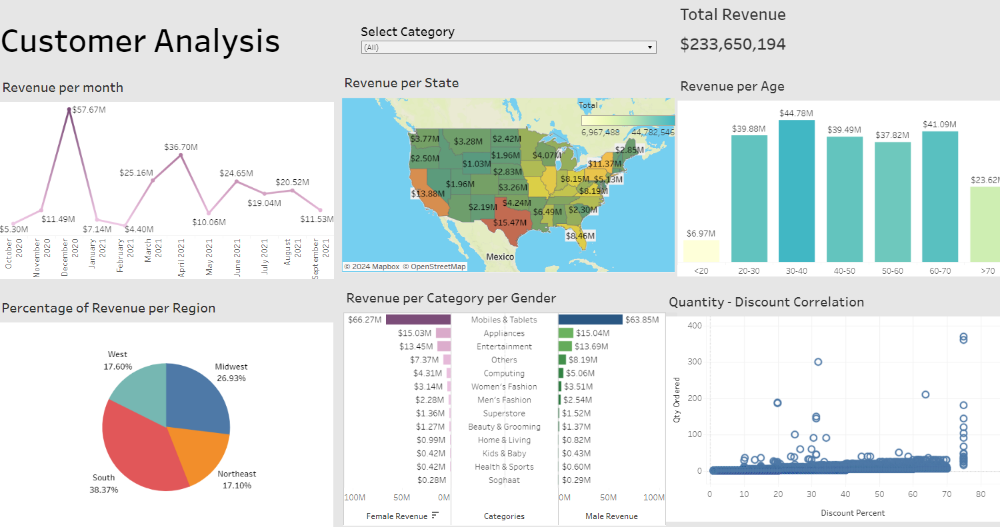

# Tableau-Project
# Tableau Dashboard: Customer Analysis

## Project Description
This Tableau project was created as part of my learning journey in data analysis and visualization. It includes:
- Revenue analysis by month, region, and age group.
- Geographic sales analysis.
- Correlation between discounts and quantity ordered.

The project was created to practice Tableau and data analysis skills.

## Dashboard Content
The dashboard includes the following visualizations:
- **Revenue per Month**: Shows seasonal changes in revenue.
- **Revenue Map by State**: Geographic analysis of sales.
- **Revenue by Customer Age Group**: Identifies which age groups generate the highest revenue.
- **Quantity-Discount Correlation**: Analyzes the impact of discounts on order quantities.
- **Revenue by Category and Gender**: Breaks down sales by product category and customer gender.

## File Content
- `Book1.twbx`: Packaged Tableau workbook that contains all the visualizations and data sources.

## How to Open
1. Download the `Book1.twbx` file.
2. Open it using Tableau Desktop or Tableau Public.

## Author
Created by ME for learning purposes. Feel free to contact me for feedback or collaboration.

---

# Tableau Dashboard: Analiza Klientów

## Opis Projektu
Ten projekt Tableau został stworzony jako część mojej nauki analizy danych i wizualizacji. Obejmuje:
- Analizę przychodów według miesięcy, regionów i grup wiekowych.
- Geograficzną analizę sprzedaży.
- Korelację między rabatami a zamówieniami.

Projekt został stworzony w celu ćwiczenia umiejętności Tableau i analizy danych.

## Zawartość Dashboardu
Dashboard zawiera następujące wizualizacje:
- **Przychody w podziale na miesiące**: Wskazuje na sezonowe zmiany przychodów.
- **Mapa przychodów per stan**: Analiza geograficzna sprzedaży.
- **Przychody w podziale na grupy wiekowe klientów**: Pozwala zrozumieć, które grupy wiekowe generują największe przychody.
- **Korelacja ilości zamówień i rabatów**: Analiza wpływu rabatów na liczbę zamówień.
- **Przychody według kategorii i płci**: Analiza sprzedaży według kategorii produktowych i płci klientów.

## Zawartość Plików
- `Book1.twbx`: Plik Tableau w formacie pakietu, zawierający wszystkie wizualizacje i źródła danych.

## Jak Otworzyć
1. Pobierz plik `Book1.twbx`.
2. Otwórz go za pomocą Tableau Desktop lub Tableau Public.

## Autor
Stworzony przez [Twoje Imię] w celach edukacyjnych. Skontaktuj się ze mną w celu przekazania opinii lub współpracy.
